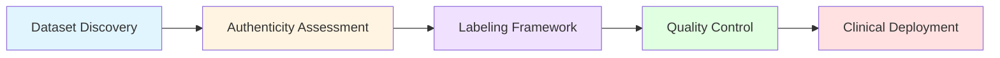
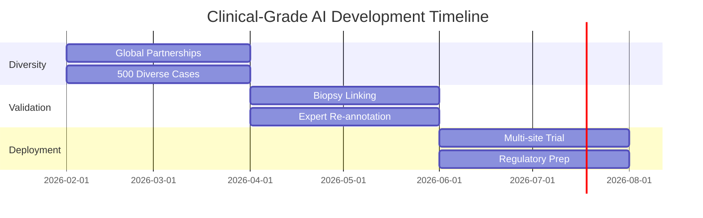
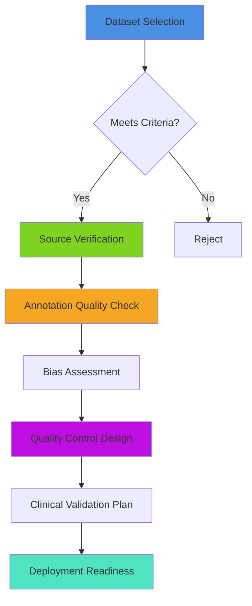

<div align="center">

# Clinical AI Dataset Curation Framework

### Building Trust in Medical AI Through Rigorous Data Validation

[](https://github.com/YOUR_USERNAME/Clinical-AI-Dataset-Curation-Framework)
[](https://github.com/YOUR_USERNAME/Clinical-AI-Dataset-Curation-Framework)

**Author:** Binisha Thakur | **Date:** February 3, 2026

[View Full Report](Clinical_Dataset_Curation.pdf) • [Datasets](#datasets-analyzed) • [Framework](#framework-overview) • [Results](#key-findings)

---

</div>

## Why This Matters

> **17.9 million people die annually from cardiovascular disease.**  
> **Lung cancer has a 5-year survival rate of only 21%.**  
> **AI can help — but only if trained on reliable data.**

This project presents a **systematic framework** for evaluating and curating biomedical datasets, ensuring AI diagnostic systems are:
- Clinically reliable
- Ethically sound
- Ready for real-world deployment

---

## Datasets Analyzed

<table>
<tr>
<td width="50%">

### LIDC-IDRI
**Lung Cancer Detection**

- **1,018 CT scans**
- **7,371 annotated nodules**
- **4 expert radiologists** per case
- **Gold standard** for CAD development

**Key Challenge:** Limited geographic diversity

</td>
<td width="50%">

### PTB-XL
**Cardiac Abnormality Detection**

- **21,837 ECG records**
- **71 diagnostic classes**
- **Dual cardiologist** validation
- **500Hz sampling** rate

**Key Challenge:** Outpatient bias (less severe cases)

</td>
</tr>
</table>

---

## Framework Overview


<details>
<summary><b>Task 1: Dataset Discovery & Justification</b></summary>

<br>

**What I evaluated:**
- Source credibility (NCI, FDA, PhysioNet)
- Sample size and diversity metrics
- Clinical impact potential
- Annotation methodology

**Outcome:** Both datasets meet international research standards

</details>

<details>
<summary><b>Task 2: Authenticity & Clinical Reliability Assessment</b></summary>

<br>

| Assessment Criteria | LIDC-IDRI | PTB-XL |
|---------------------|-----------|---------|
| **Institution** | NCI + FDA + FNIH | PTB + Leipzig Hospital |
| **Peer Review** | Medical Physics 2011 | Nature Scientific Data 2020 |
| **Sample Size** | 1,018 patients | 21,837 ECGs |
| **Annotation Quality** | 4 radiologists/case | 2 cardiologists + consensus |
| **Credibility Score** | Highest | Highest |

**Identified Biases:**
- Geographic limitation (US/Europe)
- Socioeconomic bias
- Well-documented quality metrics

</details>

<details>
<summary><b>Task 3: Labeling Framework Design</b></summary>

<br>

**Comprehensive Annotation Schema:**
```
Nodule Classification
├── Size (>=3mm, <3mm)
├── Texture (Solid, Part-solid, GGO)
├── Calcification (6 types)
├── Spiculation (1-5 scale)
├── Malignancy (1-5 scale)
└── Morphology (Sphericity, Margin, Lobulation)
```

**Quality Assurance:**
- 3-tier validation process
- Inter-rater agreement κ > 0.70
- Consensus panel for disagreements

</details>

<details>
<summary><b>Task 4: Data Filtering & Quality Control</b></summary>

<br>

**Automated Quality Checks:**

| Check | Threshold | Action |
|-------|-----------|--------|
| Signal-to-Noise | SNR > 15 dB | Reject if fails |
| Baseline Wander | < 0.5 mV | Filter or reject |
| Sampling Rate | 500 Hz / 100 Hz | Flag downsampled |
| Lead Completeness | All 12 leads | Reject incomplete |

**Class Imbalance Strategy:**
```python
# Handling 9% normal vs 91% abnormal ECGs
Stratified splitting
Class weighting (1/√frequency)
Focal loss for hard examples
NO random undersampling
```

**Result:** 94.6% usable data (20,650 / 21,837 records)

</details>

<details>
<summary><b>Task 5: Insights & Reflections</b></summary>

<br>

### Biggest Risk: Systematic Misdiagnosis at Scale

**What happens with poor data curation?**
1. **False negatives** in life-threatening conditions
2. **Population bias** leading to healthcare disparities
3. **Illusion of accuracy** resulting in unsafe deployment
4. **Lost clinical trust** delaying AI adoption

### 6-Month Improvement Roadmap


**Deliverables:**
- 500 geographically diverse cases
- 30% biopsy-confirmed ground truth
- Multi-site prospective validation
- FDA/CE Mark submission package

</details>

---

## Key Findings

### Strengths Identified

| Dataset | Strengths |
|---------|-----------|
| **LIDC-IDRI** | Gold-standard annotations<br>Semantic features for explainable AI<br>Multi-reader consensus |
| **PTB-XL** | Large scale (21K+ ECGs)<br>Hierarchical labels<br>Balanced gender distribution |

### Limitations & Mitigation

| Issue | Impact | Solution |
|-------|--------|----------|
| Geographic bias | Poor generalization | Multi-region partnerships |
| Missing outcomes | Weak supervision | Longitudinal follow-up |
| Class imbalance | Minority class errors | Weighted loss + augmentation |

---

## Clinical Impact

### Current Limitations
- Radiologists miss 20-30% of lung nodules
- ECG interpretation delays in rural clinics
- High false positive rates leading to unnecessary biopsies

### Framework Benefits
- **Second reader** catches overlooked nodules
- **Instant preliminary diagnosis** in emergency settings
- **Reduced false positives** through explainable AI
- **Democratized access** to expert-level diagnostics

> **Potential Impact:** Save thousands of lives annually through earlier detection and reduced diagnostic errors

---

## Methodology


---

## Resources & References

### Primary Sources
- **LIDC-IDRI:** [Cancer Imaging Archive](https://www.cancerimagingarchive.net/collection/lidc-idri/)
- **PTB-XL:** [PhysioNet Database](https://doi.org/10.13026/kfzx-aw45)

### Key Publications
1. **Armato et al.** (2011) - *Medical Physics* - LIDC-IDRI Dataset
2. **Wagner et al.** (2020) - *Scientific Data (Nature)* - PTB-XL Database

### Tools Used
- **3D Slicer** - Medical image annotation
- **Python + Pandas** - Data quality analysis
- **Google Sheets** - Collaborative labeling

---

## Future Work

- [ ] Implement multi-site prospective validation
- [ ] Develop automated quality assessment pipeline
- [ ] Create public benchmark for dataset curation
- [ ] Publish methodology in peer-reviewed journal
- [ ] Open-source annotation tools

---

## Connect & Collaborate

<div align="center">

**Interested in clinical AI or dataset curation?**

[](https://www.linkedin.com/in/binisha-thakur-7614a5250/)
[](mailto:binishathakur04@gmail.com)

</div>

---

## License

This framework is open for educational and research purposes.  
**Dataset rights belong to their respective institutions (NCI, PhysioNet).**

---

<div align="center">

### If you found this helpful, please star this repository

**Made for advancing Healthcare AI**


</div>
